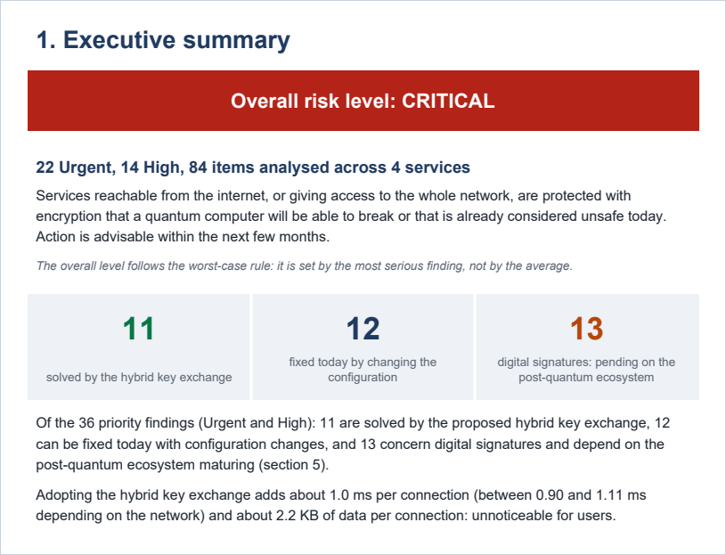

# Quantum Ready

[Español](README.md) · **English**

Crypto-agility scanner and post-quantum key exchange experiments
(ML-KEM + X25519), with an executive report for management.

## Why it exists

Almost all the encryption protecting the internet today, from websites to VPNs
and remote server access, relies on mathematical problems that a quantum
computer will be able to solve. The risk has already started: an attacker can
record encrypted traffic today and decrypt it once that computer exists
("harvest now, decrypt later"). This project answers the questions an
organisation needs to settle before migrating: what is exposed, how to protect
it, what it costs, and how to explain it to management.

## What it does

| Phase | What it does | Result with the example data |
|---|---|---|
| **1. Scanner** | Reads SSH, nginx, Apache, strongSwan, WireGuard and certificate configurations, and rates every algorithm by quantum and classical risk, weighted by each service's exposure and reach. | 84 findings across 4 services; 22 urgent. |
| **2. Hybrid exchange** | Simulates TLS 1.3's ML-KEM-768 + X25519 key exchange between a client and a server, plus an attacker who only sees the traffic. | Both sides obtain the same key; the attacker fails all 3 attempts. |
| **3. Network impact** | Measures 1,200 handshakes over real TCP with fibre, 4G and satellite (LEO and GEO) latencies. | The hybrid adds ~1 ms per connection: +19 % on fibre, +0.1 % on GEO satellite. |
| **4. Executive report** | Produces a PDF in Spanish or English for executives with no cryptography background. | Overall risk and what the solution solves: 11 of 36 priority findings, without overstating it. |

## How to run it

Tested with Python 3.13. The tool's output, command-line options and
file names are in Spanish.

```bash
python -m venv .venv
.venv/Scripts/python -m pip install -r requirements.txt   # Windows
# .venv/bin/python -m pip install -r requirements.txt     # Linux/macOS
# (in the commands below, python = the one in .venv)

# Phase 1 — scan the example configurations → informe.json
python -m quantum_ready -i ejemplos/inventario.yaml

# Phase 2 — hybrid key exchange → resultados_intercambio.json
python -m quantum_ready.tunel

# Phase 3 — network impact (100 repetitions, ~7 min; -n 10 for a quick run)
python -m quantum_ready.red -o resultados_overhead.referencia.json

# Phase 4 — executive PDF report
python -m quantum_ready.informe --idioma en
python -m quantum_ready.informe --idioma es --empresa ejemplos/empresa.yaml

# Tests
python -m pytest
```

The repository includes the Phase 3 reference measurement, so Phases 1, 2 and
4 work without re-running the benchmark.

## Example output

Executive summary of the PDF generated from the example configurations:



## Project structure

```
quantum_ready/
├── reglas.py, riesgo.py, escaner.py…   Phase 1: rulebook, risk model and scanner
├── parsers/                            SSH, nginx, Apache, IPsec, WireGuard, certificates
├── tunel/                              Phase 2: client, server and attacker
├── red/                                Phase 3: TCP sockets with injected latency
└── informe/                            Phase 4: PDF and es/en translations
ejemplos/                               example configurations, inventory and company
tests/                                  tests for the 4 phases
docs/                                   detailed documentation by phase
resultados_overhead.referencia.json     Phase 3 reference measurement
```

## Status

**4 phases complete · 365 tests (pytest) · tested on Windows with Python 3.13.**

## Notable technical decisions

- **The standard's concatenation order.** The hybrid secret is
  `ML-KEM || X25519`, as in X25519MLKEM768 (TLS 1.3) and mlkem768x25519
  (OpenSSH). Tests check it against a separately computed HKDF, because client
  and server would still agree with the order reversed.
- **The standard's roles.** The client generates the ML-KEM key pair and the
  server encapsulates, the reverse of the initial specification. The total
  bytes were the same (2,336), but not the bytes in each direction
  (1,216 / 1,120).
- **RSA by context.** In the example configurations, every priority RSA
  finding was a signature (host keys, certificates, `ECDHE-RSA`), not a key
  exchange. Counting them as "solved by the hybrid tunnel" would have inflated
  the result from 11 to 18 findings.
- **Measuring without contamination.** In the benchmark the server runs in a
  separate process: with threads, Python's GIL contention added ~0.5 ms per
  handshake, the same order of magnitude as the cost being measured.
- **Statements derived from the data.** The report does not claim "under 1 ms
  on most networks" because that only held on 2 of 4. The wording is derived
  from the measurements, and a test checks that the English PDF contains no
  Spanish, data included.

## Documentation

- [Detailed documentation by phase](docs/phases.md): formats, rulebook, risk
  model, benchmark methodology and report structure.

## Licence

[GPL v3](LICENSE).
