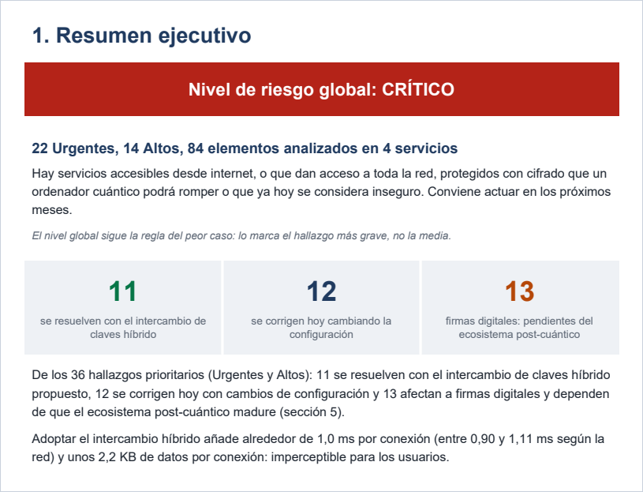

# Quantum Ready

[](https://github.com/fizsar/QuantumReady/actions/workflows/tests.yml) [](https://github.com/fizsar/QuantumReady/actions/workflows/compliance.yml)

**Español** · [English](README.en.md)

Escáner de cripto-agilidad y pruebas de intercambio de claves post-cuántico
(ML-KEM + X25519), con un informe ejecutivo para dirección.

## Por qué existe

Casi todo el cifrado que protege hoy internet, desde las webs hasta las VPN y
el acceso remoto a servidores, se basa en problemas matemáticos que un
ordenador cuántico podrá resolver. El riesgo ya ha empezado: un atacante puede
grabar hoy el tráfico cifrado y descifrarlo cuando exista ese ordenador
(«cosechar ahora, descifrar después»). Este proyecto responde a las preguntas
que una organización necesita contestar antes de migrar: qué tiene expuesto,
cómo se protege, cuánto cuesta y cómo explicárselo a dirección.

## Qué hace

| Fase | Qué hace | Resultado con los datos de ejemplo |
|---|---|---|
| **1. Escáner** | Lee configuraciones de SSH, nginx, Apache, strongSwan, WireGuard y certificados, y clasifica cada algoritmo según su riesgo cuántico y clásico, ponderado por la exposición y el alcance de cada servicio. | 84 hallazgos en 4 servicios; 22 urgentes. |
| **2. Intercambio híbrido** | Simula el intercambio ML-KEM-768 + X25519 de TLS 1.3 entre cliente y servidor, más un atacante que solo ve el tráfico. | Ambas partes obtienen la misma clave; el atacante falla sus 3 intentos. |
| **3. Impacto en red** | Mide 1200 handshakes sobre TCP real con latencias de fibra, 4G y satélite (LEO y GEO). | El híbrido añade ~1 ms por conexión: +19 % en fibra, +0,1 % en satélite GEO. |
| **4. Informe ejecutivo** | Genera un PDF en castellano o inglés para directivos sin conocimientos de criptografía. | Riesgo global y qué resuelve la solución: 11 de 36 hallazgos prioritarios, sin exagerar. |

## Cómo se ejecuta

Probado con Python 3.13.

```bash
python -m venv .venv
.venv/Scripts/python -m pip install -r requirements.txt   # Windows
# .venv/bin/python -m pip install -r requirements.txt     # Linux/macOS
# (en los comandos siguientes, python = el de .venv)

# Fase 1 — escanear las configuraciones de ejemplo → informe.json
python -m quantum_ready -i ejemplos/inventario.yaml

# Fase 2 — intercambio de claves híbrido → resultados_intercambio.json
python -m quantum_ready.tunel

# Fase 3 — impacto en red (100 repeticiones, ~7 min; -n 10 para una prueba rápida)
python -m quantum_ready.red -o resultados_overhead.referencia.json

# Fase 4 — informe ejecutivo en PDF
python -m quantum_ready.informe --idioma es
python -m quantum_ready.informe --idioma en --empresa ejemplos/empresa.yaml

# Auditoría de cumplimiento: falla (código 1) si el riesgo global es Crítico
python -m quantum_ready.cumplimiento informe.json

# Tests
python -m pytest
```

El repositorio incluye la medición de referencia de la Fase 3, así que las
Fases 1, 2 y 4 funcionan sin repetir el benchmark.

## Ejemplo de salida

Resumen ejecutivo del PDF generado con las configuraciones de ejemplo:



## Estructura del proyecto

```
quantum_ready/
├── reglas.py, riesgo.py, escaner.py…   Fase 1: libro de reglas, riesgo y escáner
├── parsers/                            SSH, nginx, Apache, IPsec, WireGuard, certificados
├── tunel/                              Fase 2: cliente, servidor y atacante
├── red/                                Fase 3: sockets TCP con latencia inyectada
└── informe/                            Fase 4: PDF y traducciones es/en
ejemplos/                               configuraciones, inventario y empresa de ejemplo
tests/                                  tests de las 4 fases
docs/                                   documentación detallada por fase
resultados_overhead.referencia.json     medición de referencia de la Fase 3
```

## Estado

**4 fases completas · 365 tests (pytest) · probado en Windows con Python 3.13.**

## Decisiones técnicas destacadas

- **Orden de concatenación del estándar.** El secreto híbrido es
  `ML-KEM || X25519`, como en X25519MLKEM768 (TLS 1.3) y mlkem768x25519
  (OpenSSH). Los tests lo verifican contra un HKDF calculado aparte, porque la
  coincidencia entre cliente y servidor se daría igual con el orden invertido.
- **Papeles del estándar.** Es el cliente quien genera el par ML-KEM y el
  servidor quien encapsula, al revés de la especificación inicial. El total de
  bytes era el mismo (2336), pero no los bytes en cada dirección (1216 / 1120).
- **RSA según el contexto.** En las configuraciones de ejemplo, todos los RSA
  prioritarios eran firmas (claves de host, certificados, `ECDHE-RSA`), no
  intercambio de claves. Contarlos como "resueltos por el túnel híbrido" habría
  inflado el resultado de 11 a 18 hallazgos.
- **Medir sin contaminar.** En el benchmark, el servidor corre en un proceso
  aparte: con hilos, la contención del GIL de Python añadía ~0,5 ms por
  handshake, del mismo orden que el coste que se quería medir.
- **Frases que salen de los datos.** El informe no afirma "menos de 1 ms en la
  mayoría de redes" porque solo se cumplía en 2 de 4. El texto se deriva de
  las mediciones, y un test comprueba que el PDF en inglés no contiene nada en
  castellano, incluidos los datos.

## Documentación

- [Documentación detallada por fase](docs/fases.md): formatos, libro de reglas,
  modelo de riesgo, metodología del benchmark y estructura del informe.

## De prueba de concepto a arquitectura de producto

Tres de las cuatro fases corresponden a los tres componentes que necesitaría
una plataforma de cripto-agilidad a escala de infraestructura; la cuarta
(impacto en red) sería el banco de pruebas para dimensionarla.

- **Agente de descubrimiento** (Fase 1 → producción): el escáner actual opera
  sobre archivos de configuración locales, con un parser por formato
  (sshd_config, nginx, Apache, IPsec, WireGuard, certificados X.509). En
  producción, la lectura de archivos daría paso a una recolección continua
  mediante agentes ligeros: hooks en los pipelines de CI/CD, análisis de
  manifiestos de Kubernetes y Helm charts, e integración con balanceadores de
  carga y API gateways para inventariar el TLS real en ejecución, no solo la
  configuración estática. El motor de clasificación (`reglas.py`) y el modelo
  de riesgo (`riesgo.py`) no dependen del origen del dato, así que cambiar la
  fuente no obligaría a rediseñarlos. Lo que sí habría que automatizar es la
  exposición y el alcance, que hoy se marcan a mano en el inventario.

- **Gateway de transición híbrida** (Fase 2 → producción): el intercambio
  ML-KEM-768 + X25519 se simula hoy entre cliente y servidor. En producción
  sería un proxy TLS que termina las conexiones externas con negociación
  híbrida (OpenSSL 3.5 o posterior y BoringSSL ya incluyen X25519MLKEM768 de
  serie) y reenvía el tráfico al backend heredado con el esquema que este
  admita. Se desplegaría como sidecar de service mesh (Envoy/Istio) o como
  reverse proxy dedicado. Así no hay que tocar el software heredado, que en
  infraestructura crítica suele ser el verdadero bloqueo de cualquier
  migración. Tiene dos límites: el tramo entre el proxy y el backend sigue
  siendo clásico, así que debe quedar dentro de una red de confianza; y el
  proxy protege el intercambio de claves, no las firmas, porque su certificado
  sigue siendo clásico.

- **Pipeline de reporting** (Fase 4 → producción): el generador de PDF lee hoy
  tres JSON estáticos. En producción, la misma lógica de agregación (riesgo
  global por la regla del peor caso y reparto de los hallazgos según quién los
  resuelve) alimentaría series temporales en lugar de fotos puntuales. Así se
  podría seguir cómo se reduce la superficie de riesgo a lo largo de la
  migración y generar evidencia auditable de forma continua, por ejemplo para
  la gestión de riesgos que exige NIS2 o para la hoja de ruta coordinada de la
  UE para la transición post-cuántica.

El punto técnico de fondo: las fases ya están desacopladas, porque solo se
comunican a través de archivos JSON, y es la condición necesaria para que cada
una escale sin reescribir las demás. El siguiente paso sería formalizar esos
formatos como esquemas versionados: cuando la Fase 4 necesitó un campo nuevo
en la salida de la Fase 1 (`algoritmo_id`), el JSON antiguo solo se pudo
detectar con una comprobación puntual.

## Licencia

[GPL v3](LICENSE).
